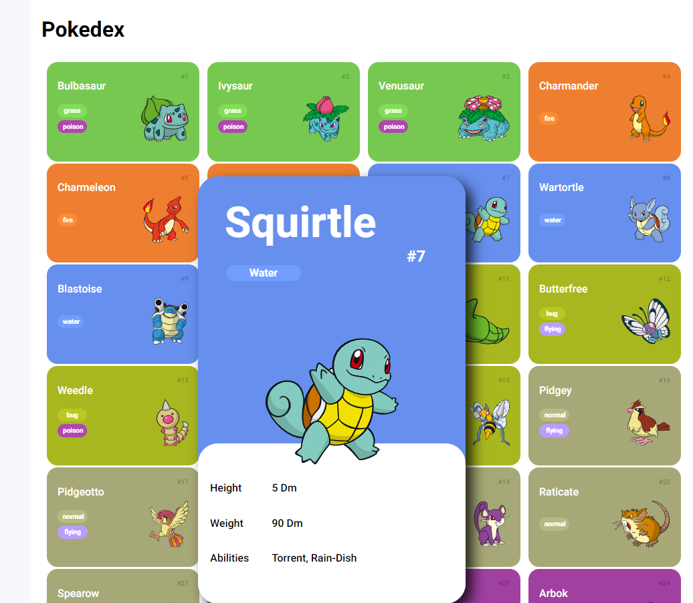

# JS Pokedex

Desafio DIO Pokedex

## 📖 Sobre

Uma pokedex feita em HTML, CSS e JavaScript, ao qual se passando o mouse é possível ver algumas características do pokemon, além de utilizar principalmente conceitos de protocolo HTTP e API.

## 🛠 Recursos utilizados

- HTML e CSS para a estrutura da página e aparência.
- JavaScript para as funcionalidades e requisições para o servidor de API do pokemon.
- PokéAPI com as informações de cada pokemon

## 🖼 Visão geral

## 📁 Referências

- [DIO Pokedex](https://github.com/digitalinnovationone/js-developer-pokedex)
- [PokeAPI](https://pokeapi.co)
